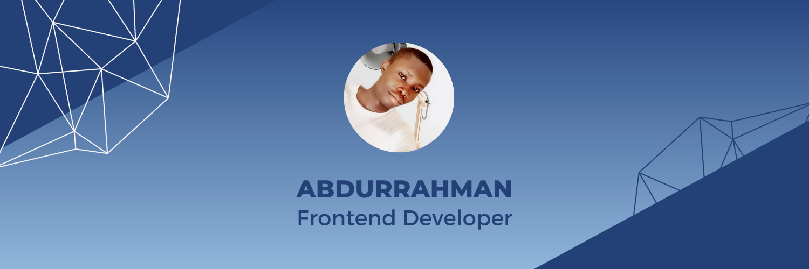

# Hi there 👋, I'm othman Abdurrahmanfrom Nigeria, I'm a Frontend web developer and a freelancer. I engage mainly on programming and Tech related stuffs and I'm looking forward to collaborating with you all..

## 🌐 Socials:
   

# 💻 Tech Stack:
           	  
# 📊 GitHub Stats:
 
 

## 🏆 GitHub Trophies

### ✍️ Random Dev Quote

### 😂 Random Dev Meme

---

  ## 💰 Buy me a coffee
   

  <!-- Proudly created with GPRM ( https://gprm.itsvg.in ) -->
  
